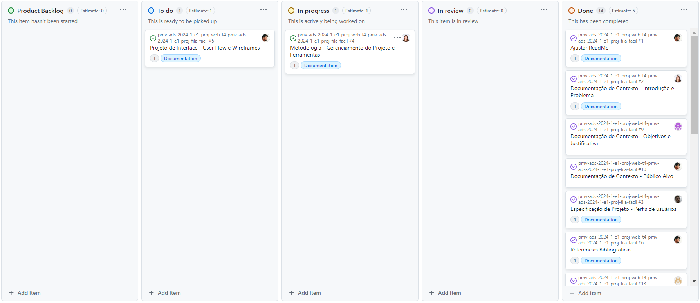
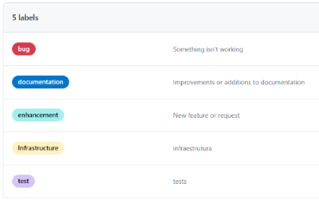

# Metodologia

Esta seção descreve a organização da equipe para a execução das tarefas do projeto e as ferramentas utilizadas para a manutenção dos códigos e demais artefatos.

## Gerenciamento de Projeto

A metodologia ágil escolhida para o desenvolvimento deste projeto foi o SCRUM, pois como citam Amaral, Fleury e Isoni (2019, p. 68), seus benefícios são a

> “visão clara dos resultados a entregar; ritmo e disciplina necessários à execução; definição de papéis e responsabilidades dos integrantes do projeto (Scrum Owner, Scrum Master e Team); empoderamento dos membros da equipe de projetos para atingir o desafio; conhecimento distribuído e compartilhado de forma colaborativa; ambiência favorável para crítica às ideias e não às pessoas”.

### Divisão de Papéis

A equipe utiliza o Scrum como base para definição do processo de desenvolvimento. A equipe está organizada da seguinte maneira:

- Scrum Master: Ytallo Bruno
- Product Owner: Ytallo Bruno.
- Equipe de Desenvolvimento: Diego Chaves dos Anjos, Gabriel Avner Gorenstein Brasil, Gabriel Roeder, Laura Furtado, Thiago Emanuel da Costa e Ytallo Bruno.
- Equipe de Design: Diego Chaves dos Anjos, Gabriel Avner Gorenstein Brasil, Gabriel Roeder, Laura Furtado, Thiago Emanuel da Costa e Ytallo Bruno.

### Processo

Para organização e distribuição das tarefas do projeto, a equipe está utilizando o GitHub, estruturado com as seguintes listas:

- Backlog: recebe as tarefas a serem trabalhadas e representa o Product Backlog. Todas as atividades identificadas no decorrer do projeto também devem ser incorporadas a esta lista.
- To Do: Esta lista representa o Sprint Backlog. Este é o Sprint atual que estamos trabalhando.
- In Progress: Quando uma tarefa tiver sido iniciada, ela é movida para cá.
- In review: Essa lista recebe as tarefas finalizadas, porém pendentes de validação por outro membro da equipe.
- Done: Nesta lista são colocadas as tarefas que passaram pelos testes e controle de qualidade e estão prontos para ser entregues ao usuário. Não há mais edições ou revisões necessárias, ele está agendado e pronto para a ação.

O quadro kanban do grupo no GitHub está disponível no link <https://github.com/orgs/ICEI-PUC-Minas-PMV-ADS/projects/941/views/1> e é apresentado na figura abaixo:

Figura 1 - Tela do Kanban no GitHub utilizada pelo grupo

### Etiquetas

As tarefas são, ainda, etiquetadas em função da natureza da atividade e seguem o seguinte esquema de cores/categorias:

- Bug (Indica erro no código)
- Documentation (Indica a necessidade de aprimoramentos ou adições à documentação)
- Enhancement (Indica a necessidade de adicionar novas funcionalidades ou melhorias no projeto)
- Infraestructure (Indica a necessidade de alterações, melhorias ou adições relacionadas à infraestrutura do projeto)
- Tests (Indica a necessidade de testes)

Figura 2 - Tela do esquema de cores e categorias das etiquetas no Kanban

### Ferramentas

As ferramentas empregadas no projeto são:

- Editor de código: Visual Studio Code (vscode)
- Ferramentas de comunicação: Microsoft Teams
- Ferramentas de desenho de tela (wireframing): MarvelApp

O editor de código foi escolhido porque ele se integra bem com o sistema de versionamento. A ferramenta de comunicação escolhida foi o Teams devido ao seu uso no dia a dia da faculdade e o MarvelApp foi escolhido como ferramente de desenho de tela devido à sua facilidade de utilização e capacidade de criar designs de alta qualidade.
Os artefatos do projeto são desenvolvidos a partir de diversas plataformas das plataformas GitHub e MarvelApp e a relação dos ambientes com seu respectivo propósito é apresentada na tabela que se segue.

| AMBIENTE                    | PLATAFORMA      | LINK DE ACESSO                                                                                                                    |
| --------------------------- | --------------- | --------------------------------------------------------------------------------------------------------------------------------- |
| Repositório de código fonte | GitHub          | https://github.com/ICEI-PUC-Minas-PMV-ADS/pmv-ads-2024-1-e1-proj-web-t4-pmv-ads-2024-1-e1-proj-fila-facil/blob/main/src/README.md |
| Documentos do projeto       | GitHub          | https://github.com/ICEI-PUC-Minas-PMV-ADS/pmv-ads-2024-1-e1-proj-web-t4-pmv-ads-2024-1-e1-proj-fila-facil/tree/main               |
| Projeto de Interface        | MarvelApp       | https://marvelapp.com/prototype/6h3ejdf/screen/94356822/handoff                                                                   |
| Gerenciamento do Projeto    | GitHub Projects | https://github.com/orgs/ICEI-PUC-Minas-PMV-ADS/projects/941                                                                       |
