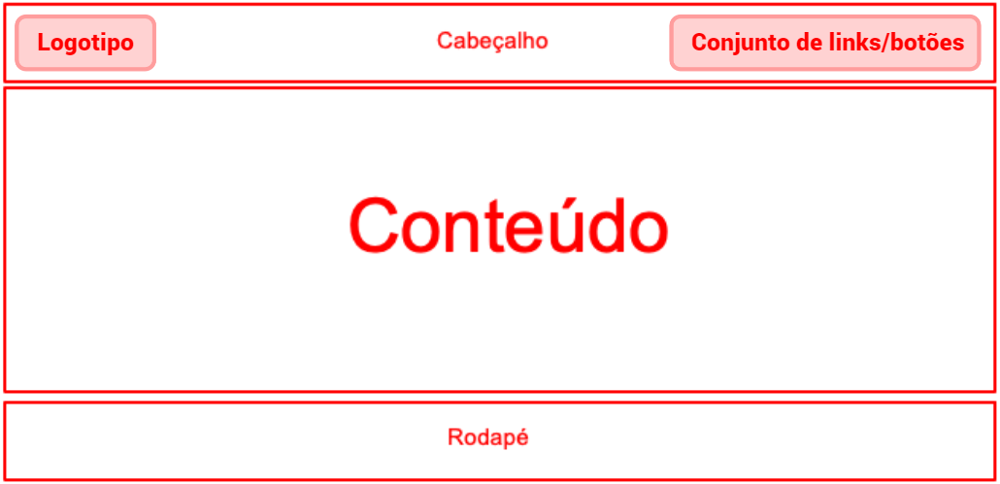

# Projeto de Interface

## User Flow

O fluxograma apresentado na figura 3 mostra o fluxo de interação do usuário pelas telas do sistema. Cada uma das telas deste fluxo é detalhada na seção de Wireframes que se segue. Para visualizar o wireframe interativo, acesse o [ambiente MarvelApp do projeto](https://marvelapp.com/prototype/6h3ejdf/screen/94356822).

Figura 3 - Fluxo de telas do usuário

## Wireframes

As telas do sistema apresentam uma estrutura comum apresentada na figura 4. Nesta estrutura existem 3 grandes blocos, sendo eles:

- Cabeçalho - local onde estão dispostos o logotipo da aplicação web e navegação principal do site (menu da aplicação), utilizando um conjunto de links/botões;
- Conteúdo - apresenta o conteúdo da tela em questão;
- Rodapé - apresenta informações sobre os direitos autorais além de botões para redes sociais (facebook, instagram, twitter).

Figura 4 - Layout padrão do site

## Tela - Home-page

A página home apresenta um primeiro espaço que sugere um local para um banner da aplicação. A seção “NOSSOS SERVIÇOS” destaca os serviços oferecidos, seguida por “SOBRE O FILA FÁCIL”, que detalha o propósito e descrição do mesmo.

Figura 5 - Página home

## Tela - Cadastro

A tela de cadastro apresenta os seguintes campos para a inserção das informações pessoais do usuário: Nome e sobrenome, e-mail, telefone, senha e confirmação de senha. Além de um link para caso o cliente já possua uma conta, poder ser redirecionado paga página de login.

Figura 6 - Página de cadastro

## Tela - Login

A tela de Login apresenta campos para a inserção de e-mail e senha, além de links para caso tenha esquecido a senha e também se não possuir uma conta, poder cadastrar-se.

Figura 7 - Página de acesso à conta do usuário

## Tela – Restaurantes

A tela de restaurantes apresenta um banner em seu início simbolizando a página atual. Logo abaixo temos a seção de restaurantes, com um input de busca e um `Carousel` (slider) com cards representando cada estabelecimento, contendo foto, nome e descrição do local, podendo avançar e voltar na lista.

Figura 8 - Página de restaurantes

## Tela – Cardápio

A tela de cardápio possui um banner do restaurante selecionado, botões para filtrar o tipo de refeição desejada, além de um input para procurar mais especificamente por um prato. Abaixo temos um `Carousel` com cards contendo foto, nome do prato, descrição, preço além de botões para adicionar o remover do carrinho, podendo avançar e voltar na lista como na página de restaurantes.

Figura 9 - Página de cardápio do restaurante selecionado

## Tela - Pedidos

A tela de pedidos apresenta um banner da mesma e cards com foto e nome do restaurante, número do pedido, itens, tempo de espera e status do pedido `em andamento`.
Se o pedido estiver finalizado, o tempo de espera será substituído por estrelas para o usuário realizar a avaliação, além do status ser alterado para `concluído`.

Figura 10 - Página de pedidos do usuário.

## Carrinho

O carrinho será uma sobreposição das telas atuais, vindo da direita para esquerda, apresentando um botão para fecha-lo, os itens do seu pedido com nome, valor, quantidad e botões para aumentar ou diminuir a quantidade. Além disso, possui também um menu para seleção da forma de pagamento, um campo informando o valor total do pedido e um botão para finaliza-lo.

Figura 11 - Carrinho do usuário
