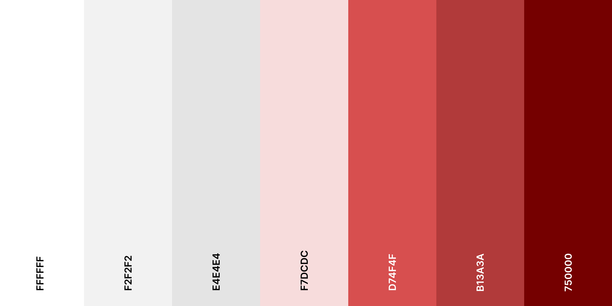

# Template padrão da Aplicação

O template do site foi construído com as linguagens de marcação HTML e CSS. A linguagem de programação JavaScript foi utilizada para garantir que a aplicação seja responsiva e possibilitasse a programação das funcionalidades necessárias.

O código-fonte do projeto pode ser acessado [aqui](https://github.com/ICEI-PUC-Minas-PMV-ADS/pmv-ads-2024-1-e1-proj-web-t4-pmv-ads-2024-1-e1-proj-fila-facil/tree/main/src). Já as imagens e ícones utilizados estão disponíveis [neste diretório](https://github.com/ICEI-PUC-Minas-PMV-ADS/pmv-ads-2024-1-e1-proj-web-t4-pmv-ads-2024-1-e1-proj-fila-facil/tree/main/src/assets/img).

As páginas do site contarão com elementos padrões, incluindo o menu de navegação, o cabeçalho e o rodpaé. Além disso, serão apliacadas as seguintes diretrizes de identidade visual:

## Cores

A paleta de cores padrão é composta pelos seguintes tons:

Figura 1 - Paleta de cores da aplicação com os respectivos códigos hexadecimais.

## Fontes

Foram empregadas três fontes distintas no desenvolvimento da aplicação, visando garantir uma experiência de leitura fluida e agradável. As fontes escolhidas foram a Arial, Arvo e Lato, cada uma contribuindo para a legibilidade e coesão visual do projeto.

---
  
## Logotipo

Para a criação do logotipo da aplicação, utilizamos as cores vermelho e branco. A utilização da cor vermelha remete aos empreendimentos gastronômicos, estimula reações cerebrais e corporais, como a aceleração dos batimentos cardíacos e da respiração, álem de aumentar o apetite, de acordo com [SEBRAE](https://sebrae.com.br/sites/PortalSebrae/artigos/cores-que-estimulam-a-fome-saiba-como-usar-no-seu-restaurante,b2c3425ef7156810VgnVCM1000001b00320aRCRD).
  

Figura 2 - Design da logotipo do Fila Fácil.
