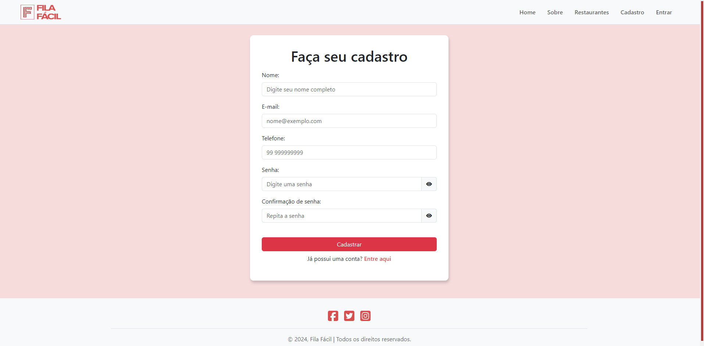
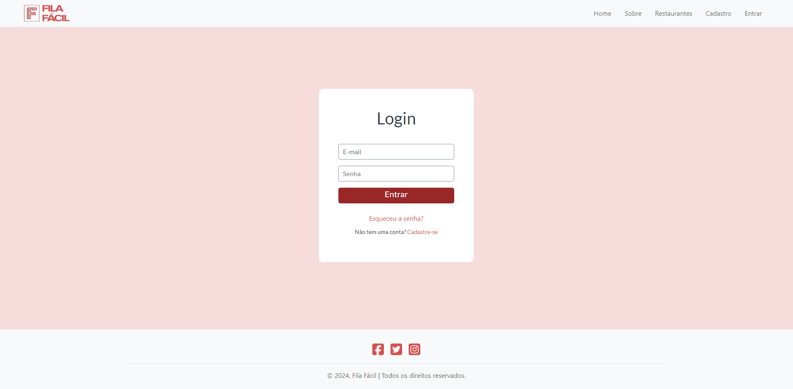
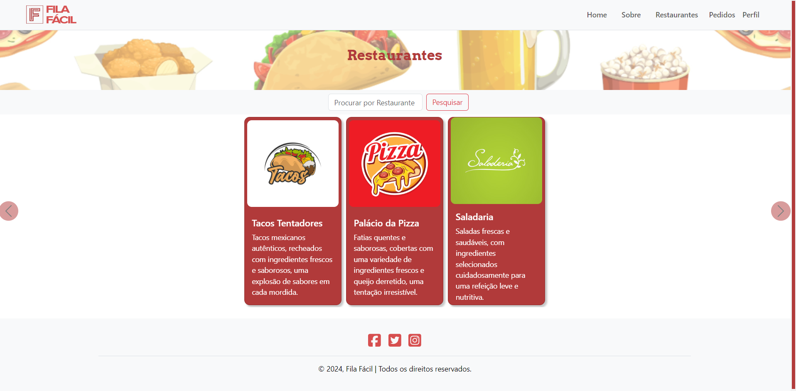

# Programação de Funcionalidades

Pré-requisitos: [especificações do projeto](https://github.com/ICEI-PUC-Minas-PMV-ADS/pmv-ads-2024-1-e1-proj-web-t4-pmv-ads-2024-1-e1-proj-fila-facil/blob/main/doc/02-Especifica%C3%A7%C3%A3o%20do%20Projeto.md), [metodologia](https://github.com/ICEI-PUC-Minas-PMV-ADS/pmv-ads-2024-1-e1-proj-web-t4-pmv-ads-2024-1-e1-proj-fila-facil/blob/main/doc/03-Metodologia.md), [projeto de interface](https://github.com/ICEI-PUC-Minas-PMV-ADS/pmv-ads-2024-1-e1-proj-web-t4-pmv-ads-2024-1-e1-proj-fila-facil/blob/main/doc/04-Projeto%20de%20Interface.md)

### Tela de cadastro (RF-01)

O acesso a tela de cadastro poderá ser feito através da opção de menu "Cadastro". As estruturas de dados foram baseadas em HTML, CSS e JavaScript.

Exemplo da tela de cadastro:

#### Requisito atendido
RF-01: A aplicação deve permitir que o usuário cadastre uma conta.

#### Artefatos da funcionalidade

- [cadastro.html](https://github.com/ICEI-PUC-Minas-PMV-ADS/pmv-ads-2024-1-e1-proj-web-t4-pmv-ads-2024-1-e1-proj-fila-facil/blob/main/src/pages/cadastro.html)
- [cadastro.js](https://github.com/ICEI-PUC-Minas-PMV-ADS/pmv-ads-2024-1-e1-proj-web-t4-pmv-ads-2024-1-e1-proj-fila-facil/blob/main/src/assets/js/cadastro.js)

#### Estrutura de Dados

- [cadastro.html](https://github.com/ICEI-PUC-Minas-PMV-ADS/pmv-ads-2024-1-e1-proj-web-t4-pmv-ads-2024-1-e1-proj-fila-facil/blob/main/src/pages/cadastro.html)

#### Instruções de acesso

1. Abra um navegador de Internet e informe a seguinte URL: https://icei-puc-minas-pmv-ads.github.io/pmv-ads-2024-1-e1-proj-web-t4-pmv-ads-2024-1-e1-proj-fila-facil/src/index.html
2. Ao clicar em "Cadastro" no canto superior direito da tela, terá acesso à página de cadastro.

#### Responsável

- Laura Furtado Amaral 
- Ytallo Bruno Canuto Guedes

### Tela de login (RF-02)

O acesso a tela de login poderá ser feito através da opção de menu "Entrar". As estruturas de dados foram baseadas em HTML, CSS e JavaScript.

Exemplo da tela de login:

#### Requisito atendido
RF-02: A aplicação deve permitir que o usuário faça o login na sua conta.

#### Artefatos da funcionalidade

- [login.html](https://github.com/ICEI-PUC-Minas-PMV-ADS/pmv-ads-2024-1-e1-proj-web-t4-pmv-ads-2024-1-e1-proj-fila-facil/blob/main/src/pages/login.html)
- [cadastro.js](https://github.com/ICEI-PUC-Minas-PMV-ADS/pmv-ads-2024-1-e1-proj-web-t4-pmv-ads-2024-1-e1-proj-fila-facil/blob/main/src/assets/js/login.js)

#### Estrutura de Dados

- [login.html](https://github.com/ICEI-PUC-Minas-PMV-ADS/pmv-ads-2024-1-e1-proj-web-t4-pmv-ads-2024-1-e1-proj-fila-facil/blob/main/src/pages/login.html)

#### Instruções de acesso

1. Abra um navegador de Internet e informe a seguinte URL: https://icei-puc-minas-pmv-ads.github.io/pmv-ads-2024-1-e1-proj-web-t4-pmv-ads-2024-1-e1-proj-fila-facil/src/index.html
2. Ao clicar em "Entrar" no canto superior direito da tela, terá acesso à página de login.

#### Responsável

- Gabriel Avner Gorenstein Brasil

### Tela de restaurantes (RF-03)

O acesso a tela de restaurantes poderá ser feito através da opção de menu "Restaurantes" após o usuário estar logado. As estruturas de dados foram baseadas em HTML, CSS e JavaScript.

Exemplo da tela de restaurantes:

#### Requisito atendido
RF-03: A aplicação deve permitir que o usuário visualize os restaurantes cadastrados.

#### Artefatos da funcionalidade

- [restaurantes.html](https://github.com/ICEI-PUC-Minas-PMV-ADS/pmv-ads-2024-1-e1-proj-web-t4-pmv-ads-2024-1-e1-proj-fila-facil/blob/main/src/pages/restaurantes.html)
- [cardapioCarouselScript.js](https://icei-puc-minas-pmv-ads.github.io/pmv-ads-2024-1-e1-proj-web-t4-pmv-ads-2024-1-e1-proj-fila-facil/src/assets/js/cardapioCarouselScript.js)

#### Estrutura de Dados

- [restaurantes.html](https://github.com/ICEI-PUC-Minas-PMV-ADS/pmv-ads-2024-1-e1-proj-web-t4-pmv-ads-2024-1-e1-proj-fila-facil/blob/main/src/pages/restaurantes.html)

#### Instruções de acesso

1. Abra um navegador de Internet e informe a seguinte URL: https://icei-puc-minas-pmv-ads.github.io/pmv-ads-2024-1-e1-proj-web-t4-pmv-ads-2024-1-e1-proj-fila-facil/src/index.html
2. Clique em "Cadastro" e realize a criação da sua conta
3. Insira suas informações de usuário e senha ao ser redirecionado para a página de login e clique em "Entrar"

#### Responsável

- Diego Chaves dos Anjos

### Tela de cardápio (RF-04)

O acesso a tela de cardápio poderá ser feito ao clicar em algum restaurante após o usuário estar logado. As estruturas de dados foram baseadas em HTML, CSS e JavaScript.

Exemplo da tela de cardápio:

#### Requisito atendido
RF-03: A aplicação deve permitir que o usuário visualize o cardápio completo.	

#### Artefatos da funcionalidade

- [cardapio.html](https://github.com/ICEI-PUC-Minas-PMV-ADS/pmv-ads-2024-1-e1-proj-web-t4-pmv-ads-2024-1-e1-proj-fila-facil/blob/main/src/pages/cardapio.html)
- [cardapioCarouselScript.js](https://icei-puc-minas-pmv-ads.github.io/pmv-ads-2024-1-e1-proj-web-t4-pmv-ads-2024-1-e1-proj-fila-facil/src/assets/js/cardapioCarouselScript.js)

#### Estrutura de Dados

- [cardapio.html](https://github.com/ICEI-PUC-Minas-PMV-ADS/pmv-ads-2024-1-e1-proj-web-t4-pmv-ads-2024-1-e1-proj-fila-facil/blob/main/src/pages/cardapio.html)

#### Instruções de acesso

1. Abra um navegador de Internet e informe a seguinte URL: https://icei-puc-minas-pmv-ads.github.io/pmv-ads-2024-1-e1-proj-web-t4-pmv-ads-2024-1-e1-proj-fila-facil/src/index.html
2. Clique em "Cadastro" e realize a criação da sua conta
3. Insira suas informações de usuário e senha ao ser redirecionado para a página de login e clique em "Entrar"
4. Clique em um dos restaurantes para visualizar seu cardápio

#### Responsável

- Gabriel Roeder
