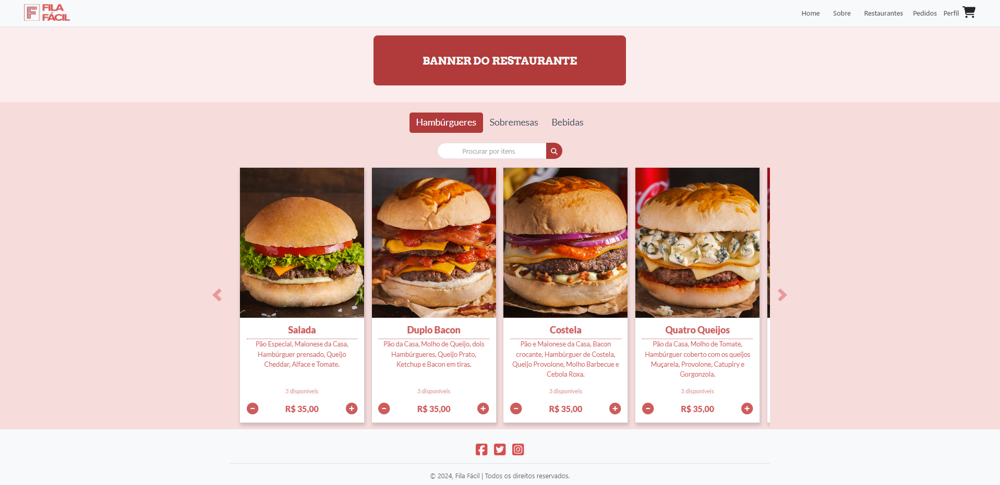
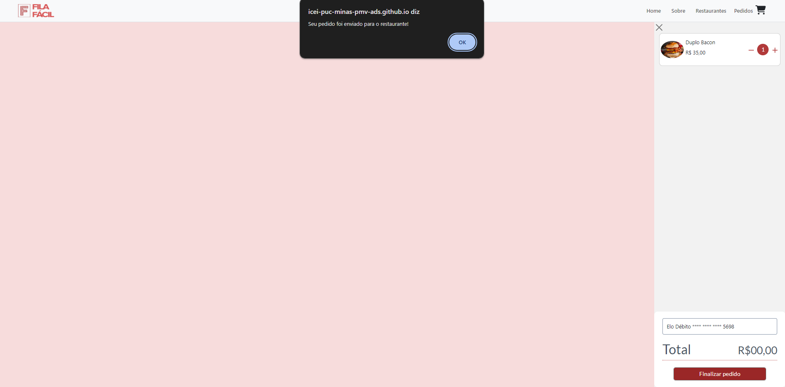
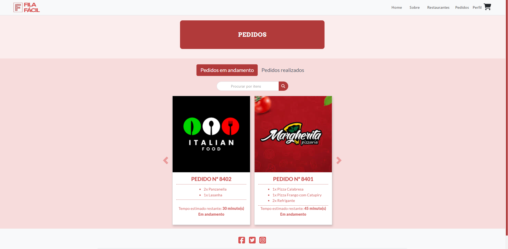
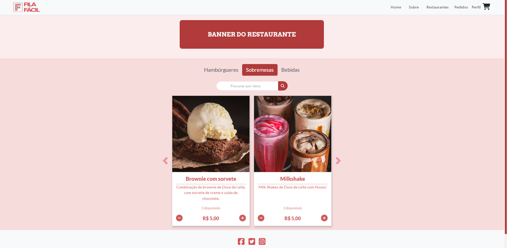
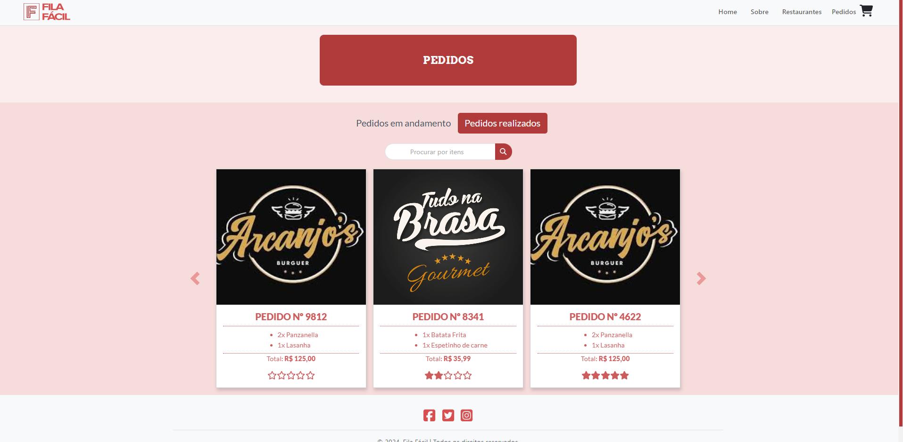
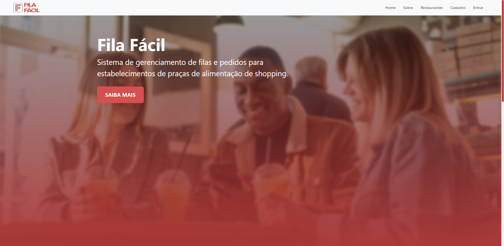

# Programação de Funcionalidades

Pré-requisitos: [especificações do projeto](https://github.com/ICEI-PUC-Minas-PMV-ADS/pmv-ads-2024-1-e1-proj-web-t4-pmv-ads-2024-1-e1-proj-fila-facil/blob/main/doc/02-Especifica%C3%A7%C3%A3o%20do%20Projeto.md), [metodologia](https://github.com/ICEI-PUC-Minas-PMV-ADS/pmv-ads-2024-1-e1-proj-web-t4-pmv-ads-2024-1-e1-proj-fila-facil/blob/main/doc/03-Metodologia.md), [projeto de interface](https://github.com/ICEI-PUC-Minas-PMV-ADS/pmv-ads-2024-1-e1-proj-web-t4-pmv-ads-2024-1-e1-proj-fila-facil/blob/main/doc/04-Projeto%20de%20Interface.md)

### Tela de cadastro (RF-01)

O acesso à tela de cadastro poderá ser feito através da opção de menu "Cadastro". As estruturas de dados foram baseadas em HTML, CSS e JavaScript.

Exemplo da tela de cadastro:

#### Requisito atendido
RF-01: A aplicação deve permitir que o usuário cadastre uma conta.

#### Artefatos da funcionalidade

- [cadastro.html](https://github.com/ICEI-PUC-Minas-PMV-ADS/pmv-ads-2024-1-e1-proj-web-t4-pmv-ads-2024-1-e1-proj-fila-facil/blob/main/src/pages/cadastro.html)
- [cadastro.js](https://github.com/ICEI-PUC-Minas-PMV-ADS/pmv-ads-2024-1-e1-proj-web-t4-pmv-ads-2024-1-e1-proj-fila-facil/blob/main/src/assets/js/cadastro.js)
- [cadastroStyle.css](https://github.com/ICEI-PUC-Minas-PMV-ADS/pmv-ads-2024-1-e1-proj-web-t4-pmv-ads-2024-1-e1-proj-fila-facil/blob/main/src/assets/css/cadastroStyle.css)

#### Instruções de acesso

1. Abra um navegador de Internet e informe a seguinte URL: https://icei-puc-minas-pmv-ads.github.io/pmv-ads-2024-1-e1-proj-web-t4-pmv-ads-2024-1-e1-proj-fila-facil/src/index.html
2. Ao clicar em "Cadastro" no canto superior direito da tela, terá acesso à página de cadastro.

#### Responsável

- Laura Furtado Amaral 
- Ytallo Bruno Canuto Guedes

### Tela de login (RF-02)

O acesso à tela de login poderá ser feito através da opção de menu "Entrar". As estruturas de dados foram baseadas em HTML, CSS e JavaScript.

Exemplo da tela de login:

#### Requisito atendido
RF-02: A aplicação deve permitir que o usuário faça o login na sua conta.

#### Artefatos da funcionalidade

- [login.html](https://github.com/ICEI-PUC-Minas-PMV-ADS/pmv-ads-2024-1-e1-proj-web-t4-pmv-ads-2024-1-e1-proj-fila-facil/blob/main/src/pages/login.html)
- [login.js](https://github.com/ICEI-PUC-Minas-PMV-ADS/pmv-ads-2024-1-e1-proj-web-t4-pmv-ads-2024-1-e1-proj-fila-facil/blob/main/src/assets/js/login.js)
- [login.css](https://github.com/ICEI-PUC-Minas-PMV-ADS/pmv-ads-2024-1-e1-proj-web-t4-pmv-ads-2024-1-e1-proj-fila-facil/blob/main/src/assets/css/login.css)

#### Instruções de acesso

1. Abra um navegador de Internet e informe a seguinte URL: https://icei-puc-minas-pmv-ads.github.io/pmv-ads-2024-1-e1-proj-web-t4-pmv-ads-2024-1-e1-proj-fila-facil/src/index.html
2. Ao clicar em "Entrar" no canto superior direito da tela, terá acesso à página de login.

#### Responsável

- Gabriel Avner Gorenstein Brasil

### Tela de restaurantes (RF-03)

O acesso à tela de restaurantes poderá ser feito através da opção de menu "Restaurantes". As estruturas de dados foram baseadas em HTML, CSS e JavaScript.

Exemplo da tela de restaurantes:

#### Requisito atendido
RF-03: A aplicação deve permitir que o usuário visualize os restaurantes cadastrados.

#### Artefatos da funcionalidade

- [restaurantes.html](https://github.com/ICEI-PUC-Minas-PMV-ADS/pmv-ads-2024-1-e1-proj-web-t4-pmv-ads-2024-1-e1-proj-fila-facil/blob/main/src/pages/restaurantes.html)
- [cardapioCarouselScript.js](https://icei-puc-minas-pmv-ads.github.io/pmv-ads-2024-1-e1-proj-web-t4-pmv-ads-2024-1-e1-proj-fila-facil/src/assets/js/cardapioCarouselScript.js)
- [restauranteStyle.css](https://github.com/ICEI-PUC-Minas-PMV-ADS/pmv-ads-2024-1-e1-proj-web-t4-pmv-ads-2024-1-e1-proj-fila-facil/blob/main/src/assets/css/restauranteStyle.css)

#### Instruções de acesso

1. Abra um navegador de Internet e informe a seguinte URL: https://icei-puc-minas-pmv-ads.github.io/pmv-ads-2024-1-e1-proj-web-t4-pmv-ads-2024-1-e1-proj-fila-facil/src/index.html
2. Ao clicar em "Restaurantes" no canto superior direito da tela, terá acesso à página de restaurantes.

#### Responsável

- Diego Chaves dos Anjos

### Tela de cardápio (RF-04)

O acesso à tela de cardápio poderá ser feito ao clicar em algum restaurante. As estruturas de dados foram baseadas em HTML, CSS e JavaScript.

Exemplo da tela de cardápio:

#### Requisito atendido
RF-04: A aplicação deve permitir que o usuário visualize o cardápio completo.	

#### Artefatos da funcionalidade

- [cardapio.html](https://github.com/ICEI-PUC-Minas-PMV-ADS/pmv-ads-2024-1-e1-proj-web-t4-pmv-ads-2024-1-e1-proj-fila-facil/blob/main/src/pages/cardapio.html)
- [cardapioCarouselScript.js](https://icei-puc-minas-pmv-ads.github.io/pmv-ads-2024-1-e1-proj-web-t4-pmv-ads-2024-1-e1-proj-fila-facil/src/assets/js/cardapioCarouselScript.js)
- [cardapioStyle.css](https://github.com/ICEI-PUC-Minas-PMV-ADS/pmv-ads-2024-1-e1-proj-web-t4-pmv-ads-2024-1-e1-proj-fila-facil/blob/main/src/assets/css/cardapioStyle.css)

#### Instruções de acesso

1. Abra um navegador de Internet e informe a seguinte URL: https://icei-puc-minas-pmv-ads.github.io/pmv-ads-2024-1-e1-proj-web-t4-pmv-ads-2024-1-e1-proj-fila-facil/src/index.html
2. Clique em "Restaurantes" no menu
3. Clique em um dos restaurantes para visualizar seu cardápio

#### Responsável

- Gabriel Roeder

### Realizar e pagar pedidos online (RF-05 e RF-06)

Para pagar e realizar pedidos online, é necessário adicionar um item no carrinho, ir ao carrinho clicando em seu respectivo ícone no menu, selecionar um meio de pagamento e clicar em "Finalizar pedido". As estruturas de dados foram baseadas em HTML, CSS e JavaScript.

Exemplo da finalização de um pedido:

#### Requisito atendido
RF-05: A aplicação deve permitir que o usuário realize a compra de itens no restaurante remotamente.
RF-06: A aplicação deve permitir que o usuário realize o pagamento online do pedido.

#### Artefatos da funcionalidade

- [carrinho.html](https://github.com/ICEI-PUC-Minas-PMV-ADS/pmv-ads-2024-1-e1-proj-web-t4-pmv-ads-2024-1-e1-proj-fila-facil/blob/main/src/pages/carrinho.html)
- [carrinho.js](https://github.com/ICEI-PUC-Minas-PMV-ADS/pmv-ads-2024-1-e1-proj-web-t4-pmv-ads-2024-1-e1-proj-fila-facil/blob/main/src/assets/js/carrinho.js)
- [carrinhoStyle.css](https://github.com/ICEI-PUC-Minas-PMV-ADS/pmv-ads-2024-1-e1-proj-web-t4-pmv-ads-2024-1-e1-proj-fila-facil/blob/main/src/assets/css/carrinhoStyle.css)

#### Instruções de acesso

1. Abra um navegador de Internet e informe a seguinte URL: https://icei-puc-minas-pmv-ads.github.io/pmv-ads-2024-1-e1-proj-web-t4-pmv-ads-2024-1-e1-proj-fila-facil/src/index.html
2. Clique em Restaurantes no menu
3. Clique em um dos restaurantes para visualizar seu cardápio
4. Adicione um dos itens no carrinho
5. Clique no ícone de carrinho
6. Selecione uma forma de pagamento
7. Clique em "Finalizar Pedidos"

#### Responsável

- Laura Furtado Amaral

### Tela de status do pedido (RF-07)

O acesso à tela de pedidos poderá ser feito através da opção de menu "Pedidos". As estruturas de dados foram baseadas em HTML, CSS e JavaScript.

Exemplo da tela de pedidos:

#### Requisito atendido
RF-07: A aplicação deve permitir que o usuário visualize o status do seu pedido.

#### Artefatos da funcionalidade

- [pedidos.html](https://github.com/ICEI-PUC-Minas-PMV-ADS/pmv-ads-2024-1-e1-proj-web-t4-pmv-ads-2024-1-e1-proj-fila-facil/blob/main/src/pages/pedidos.html)
- [pedidos.js](https://github.com/ICEI-PUC-Minas-PMV-ADS/pmv-ads-2024-1-e1-proj-web-t4-pmv-ads-2024-1-e1-proj-fila-facil/blob/main/src/assets/js/pedidos.js)
- [pedidosstyle.css](https://github.com/ICEI-PUC-Minas-PMV-ADS/pmv-ads-2024-1-e1-proj-web-t4-pmv-ads-2024-1-e1-proj-fila-facil/blob/main/src/assets/css/pedidosstyle.css)

#### Instruções de acesso

1. Abra um navegador de Internet e informe a seguinte URL: https://icei-puc-minas-pmv-ads.github.io/pmv-ads-2024-1-e1-proj-web-t4-pmv-ads-2024-1-e1-proj-fila-facil/src/index.html
3. Ao clicar em "Pedidos" no menu, terá acesso à página de pedidos e seu status.

#### Responsável

- Thiago Emanuel da Costa

### Filtragem de pratos (RF-08)

O acesso à filtragem de pratos poderá ser feita na página de cardápio, ao clicar nas categorias ou utilizar o campo de busca. As estruturas de dados foram baseadas em HTML, CSS e JavaScript.

Exemplo da tela de pedidos:

#### Requisito atendido
RF-08: A aplicação deve permitir que o usuário filtre pratos pelo tipo de refeição.

#### Artefatos da funcionalidade

- [cardapio.html](https://github.com/ICEI-PUC-Minas-PMV-ADS/pmv-ads-2024-1-e1-proj-web-t4-pmv-ads-2024-1-e1-proj-fila-facil/blob/main/src/pages/cardapio.html)
- [cardapioCarouselScript.js](https://github.com/ICEI-PUC-Minas-PMV-ADS/pmv-ads-2024-1-e1-proj-web-t4-pmv-ads-2024-1-e1-proj-fila-facil/blob/main/src/assets/js/cardapioCarouselScript.js)
- [cardapioStyle.css](https://github.com/ICEI-PUC-Minas-PMV-ADS/pmv-ads-2024-1-e1-proj-web-t4-pmv-ads-2024-1-e1-proj-fila-facil/blob/main/src/assets/css/cardapioStyle.css)

#### Instruções de acesso

1. Abra um navegador de Internet e informe a seguinte URL: https://icei-puc-minas-pmv-ads.github.io/pmv-ads-2024-1-e1-proj-web-t4-pmv-ads-2024-1-e1-proj-fila-facil/src/index.html
2. Clique em "Restaurantes" no menu
3. Selecione um dos restaurantes para visualizer seu cardápio
5. Clique em uma das opções acima do campo de busca ou utilize o campo de busca para realizar a filtragem

#### Responsável

- Gabriel Roeder

### Avaliação dos pedidos (RF-09)

O acesso à avaliação de pedidos poderá ser feita na página de pedidos ao clicar em "Pedidos realizados" e na respectiva estrela. As estruturas de dados foram baseadas em HTML, CSS e JavaScript.

Exemplo da tela de pedidos:

#### Requisito atendido
RF-09: A aplicação deve permitir que o usuário avalie o pedido e o restaurante.

#### Artefatos da funcionalidade

- [pedidos.html](https://github.com/ICEI-PUC-Minas-PMV-ADS/pmv-ads-2024-1-e1-proj-web-t4-pmv-ads-2024-1-e1-proj-fila-facil/blob/main/src/pages/pedidos.html)
- [pedidos.js](https://github.com/ICEI-PUC-Minas-PMV-ADS/pmv-ads-2024-1-e1-proj-web-t4-pmv-ads-2024-1-e1-proj-fila-facil/blob/main/src/assets/js/pedidos.js)
- [pedidosstyle.css](https://github.com/ICEI-PUC-Minas-PMV-ADS/pmv-ads-2024-1-e1-proj-web-t4-pmv-ads-2024-1-e1-proj-fila-facil/blob/main/src/assets/css/pedidosstyle.css)

#### Instruções de acesso

1. Abra um navegador de Internet e informe a seguinte URL: https://icei-puc-minas-pmv-ads.github.io/pmv-ads-2024-1-e1-proj-web-t4-pmv-ads-2024-1-e1-proj-fila-facil/src/index.html
2. Clique em "Pedidos" no menu
3. Clique em "Pedidos realizados" e dê a nota clicando em uma das estrelas do card do pedido

#### Responsável

- Gabriel Roeder e Thiago Emanuel da Costa

### Tela inicial

O acesso à tela inicial é a primeira tela que o usuário visualiza ao entrar no site. As estruturas de dados foram baseadas em HTML, CSS e JavaScript.

Exemplo da tela de pedidos:

#### Artefatos da funcionalidade

- [index.html](https://github.com/ICEI-PUC-Minas-PMV-ADS/pmv-ads-2024-1-e1-proj-web-t4-pmv-ads-2024-1-e1-proj-fila-facil/blob/main/src/index.html)
- [homeCarouselScript.js](https://github.com/ICEI-PUC-Minas-PMV-ADS/pmv-ads-2024-1-e1-proj-web-t4-pmv-ads-2024-1-e1-proj-fila-facil/blob/main/src/assets/js/homeCarouselScript.js)
- [homeStyle.css](https://github.com/ICEI-PUC-Minas-PMV-ADS/pmv-ads-2024-1-e1-proj-web-t4-pmv-ads-2024-1-e1-proj-fila-facil/blob/main/src/assets/css/homeStyle.css)

#### Instruções de acesso

1. Abra um navegador de Internet e informe a seguinte URL: https://icei-puc-minas-pmv-ads.github.io/pmv-ads-2024-1-e1-proj-web-t4-pmv-ads-2024-1-e1-proj-fila-facil/src/index.html

#### Responsável

- Ytallo Bruno Canuto Guedes

